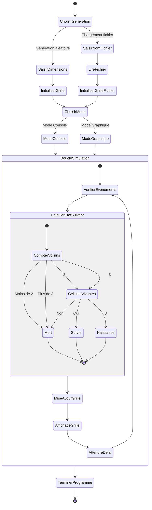

```mermaid 
stateDiagram-v2
[*] --> ChoisirGeneration
ChoisirGeneration --> SaisirNomFichier: Chargement fichier
SaisirNomFichier --> LireFichier
LireFichier --> InitialiserGrilleFichier

    ChoisirGeneration --> SaisirDimensions: Génération aléatoire
    SaisirDimensions --> InitialiserGrille
    
    InitialiserGrille --> ChoisirMode
    InitialiserGrilleFichier --> ChoisirMode
    
    ChoisirMode --> ModeConsole: Mode Console
    ChoisirMode --> ModeGraphique: Mode Graphique
    
    ModeConsole --> BoucleSimulation
    ModeGraphique --> BoucleSimulation
    
    state BoucleSimulation {
        [*] --> VerifierEvenements
        
        state CalculerEtatSuivant {
            [*] --> CompterVoisins
            
            CompterVoisins --> Mort: Moins de 2
            CompterVoisins --> Mort: Plus de 3
            CompterVoisins --> CellulesVivantes: 2
            CompterVoisins --> CellulesVivantes: 3
            
            CellulesVivantes --> Survie: Oui
            CellulesVivantes --> Mort: Non
            CellulesVivantes --> Naissance: 3
            
            Mort --> [*]
            Survie --> [*]
            Naissance --> [*]
        }
        
        VerifierEvenements --> CalculerEtatSuivant
        CalculerEtatSuivant --> MiseAJourGrille
        MiseAJourGrille --> AffichageGrille
        AffichageGrille --> AttendreDelai
        AttendreDelai --> VerifierEvenements
    }
    
    BoucleSimulation --> TerminerProgramme
    TerminerProgramme --> [*]

```