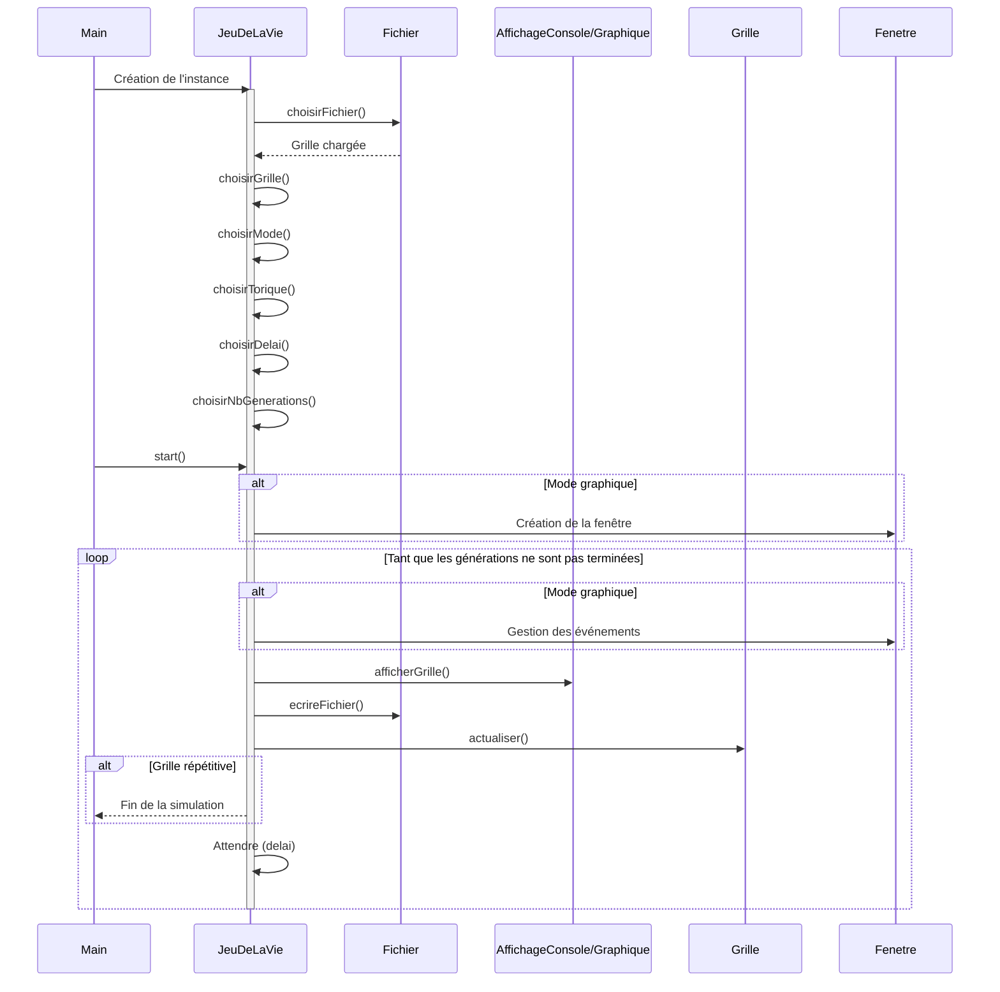

```mermaid
sequenceDiagram
    participant Main
    participant JeuDeLaVie
    participant Fichier
    participant AffichageConsole/Graphique
    participant Grille
    participant Fenetre

    Main->>JeuDeLaVie: Création de l'instance
    activate JeuDeLaVie

    JeuDeLaVie->>Fichier: choisirFichier()
    Fichier-->>JeuDeLaVie: Grille chargée

    JeuDeLaVie->>JeuDeLaVie: choisirGrille()
    JeuDeLaVie->>JeuDeLaVie: choisirMode()
    JeuDeLaVie->>JeuDeLaVie: choisirTorique()
    JeuDeLaVie->>JeuDeLaVie: choisirDelai()
    JeuDeLaVie->>JeuDeLaVie: choisirNbGenerations()

    Main->>JeuDeLaVie: start()

    alt Mode graphique
        JeuDeLaVie->>Fenetre: Création de la fenêtre
    end

    loop Tant que les générations ne sont pas terminées
        alt Mode graphique
            JeuDeLaVie->>Fenetre: Gestion des événements
        end

        JeuDeLaVie->>AffichageConsole/Graphique: afficherGrille()
        
        JeuDeLaVie->>Fichier: ecrireFichier()
        
        JeuDeLaVie->>Grille: actualiser()
        
        alt Grille répétitive
            JeuDeLaVie-->>Main: Fin de la simulation
        end
        
        JeuDeLaVie->>JeuDeLaVie: Attendre (delai)
    end

    deactivate JeuDeLaVie
```