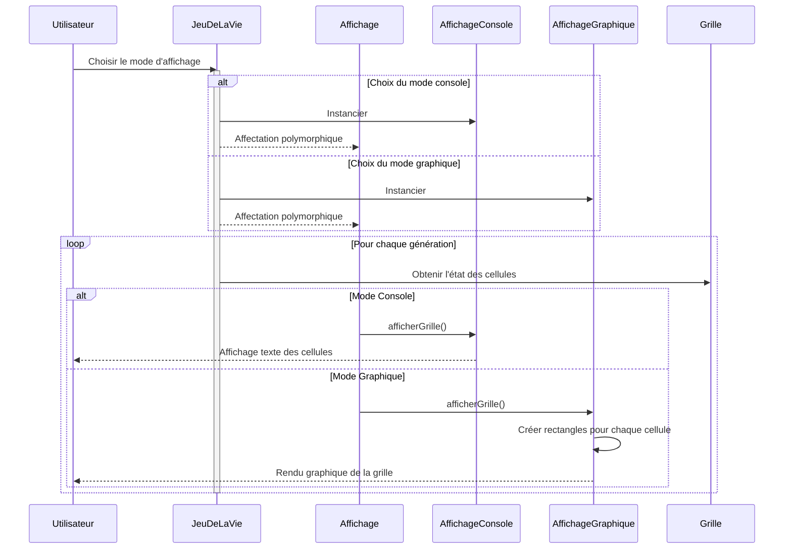

```mermaid
sequenceDiagram
    participant Utilisateur
    participant JeuDeLaVie
    participant Affichage
    participant AffichageConsole
    participant AffichageGraphique
    participant Grille

    Utilisateur->>JeuDeLaVie: Choisir le mode d'affichage
    activate JeuDeLaVie

    alt Choix du mode console
        JeuDeLaVie->>AffichageConsole: Instancier
        JeuDeLaVie-->>Affichage: Affectation polymorphique
    else Choix du mode graphique
        JeuDeLaVie->>AffichageGraphique: Instancier
        JeuDeLaVie-->>Affichage: Affectation polymorphique
    end

    loop Pour chaque génération
        JeuDeLaVie->>Grille: Obtenir l'état des cellules

        alt Mode Console
            Affichage->>AffichageConsole: afficherGrille()
            AffichageConsole-->>Utilisateur: Affichage texte des cellules
        else Mode Graphique
            Affichage->>AffichageGraphique: afficherGrille()
            AffichageGraphique->>AffichageGraphique: Créer rectangles pour chaque cellule
            AffichageGraphique-->>Utilisateur: Rendu graphique de la grille
        end
    end

    deactivate JeuDeLaVie
```