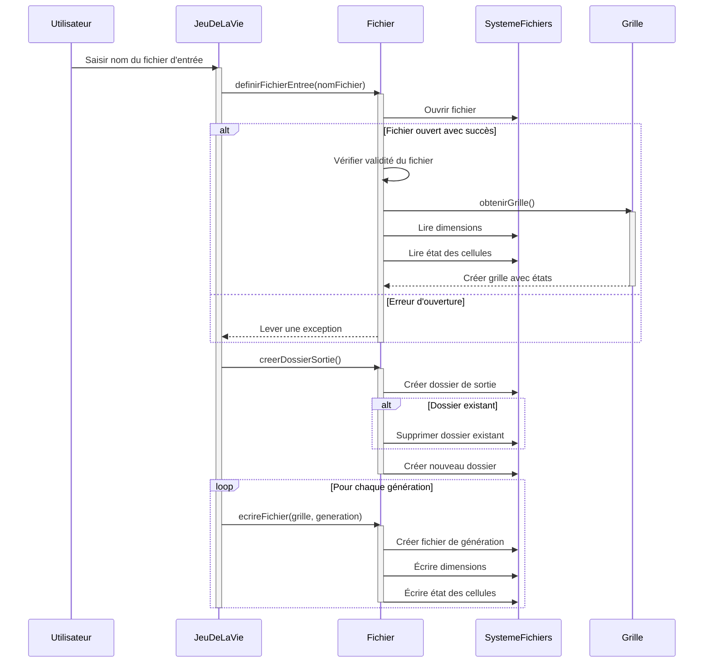

```mermaid
sequenceDiagram
    participant Utilisateur
    participant JeuDeLaVie
    participant Fichier
    participant SystemeFichiers
    participant Grille

    Utilisateur->>JeuDeLaVie: Saisir nom du fichier d'entrée
    activate JeuDeLaVie

    JeuDeLaVie->>Fichier: definirFichierEntree(nomFichier)
    activate Fichier

    Fichier->>SystemeFichiers: Ouvrir fichier
    alt Fichier ouvert avec succès
        Fichier->>Fichier: Vérifier validité du fichier
        Fichier->>Grille: obtenirGrille()
        activate Grille
        Fichier->>SystemeFichiers: Lire dimensions
        Fichier->>SystemeFichiers: Lire état des cellules
        Grille-->>Fichier: Créer grille avec états
        deactivate Grille
    else Erreur d'ouverture
        Fichier-->>JeuDeLaVie: Lever une exception
    end

    deactivate Fichier

    JeuDeLaVie->>Fichier: creerDossierSortie()
    activate Fichier

    Fichier->>SystemeFichiers: Créer dossier de sortie
    alt Dossier existant
        Fichier->>SystemeFichiers: Supprimer dossier existant
    end
    Fichier->>SystemeFichiers: Créer nouveau dossier

    deactivate Fichier

    loop Pour chaque génération
        JeuDeLaVie->>Fichier: ecrireFichier(grille, generation)
        activate Fichier

        Fichier->>SystemeFichiers: Créer fichier de génération
        Fichier->>SystemeFichiers: Écrire dimensions
        Fichier->>SystemeFichiers: Écrire état des cellules

        deactivate Fichier
    end

    deactivate JeuDeLaVie
```