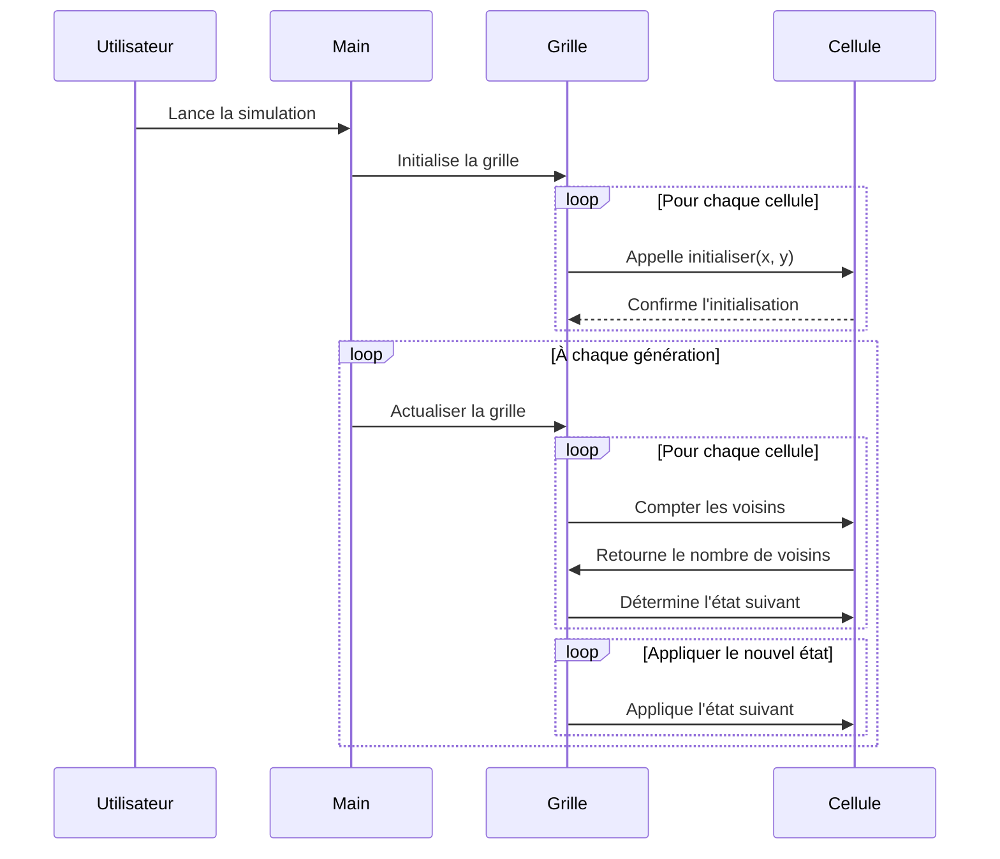

```mermaid
sequenceDiagram
    participant User as Utilisateur
    participant Main as Main
    participant Grille as Grille
    participant Cellule as Cellule

    User->>Main: Lance la simulation
    Main->>Grille: Initialise la grille
    loop Pour chaque cellule
        Grille->>Cellule: Appelle initialiser(x, y)
        Cellule-->>Grille: Confirme l'initialisation
    end

    loop À chaque génération
        Main->>Grille: Actualiser la grille
        loop Pour chaque cellule
            Grille->>Cellule: Compter les voisins
            Cellule->>Grille: Retourne le nombre de voisins
            Grille->>Cellule: Détermine l'état suivant
        end
        loop Appliquer le nouvel état
            Grille->>Cellule: Applique l'état suivant
        end
    end

```