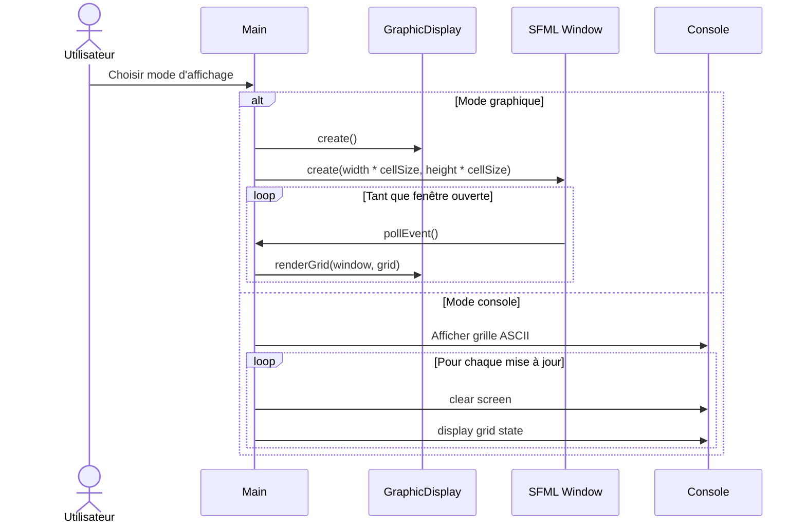

```mermaid
sequenceDiagram
actor User as Utilisateur
participant Main
participant GD as GraphicDisplay
participant Window as SFML Window
participant Console

    User->>Main: Choisir mode d'affichage
    alt Mode graphique
        Main->>GD: create()
        Main->>Window: create(width * cellSize, height * cellSize)
        loop Tant que fenêtre ouverte
            Window->>Main: pollEvent()
            Main->>GD: renderGrid(window, grid)
        end
    else Mode console
        Main->>Console: Afficher grille ASCII
        loop Pour chaque mise à jour
            Main->>Console: clear screen
            Main->>Console: display grid state
        end
    end
```