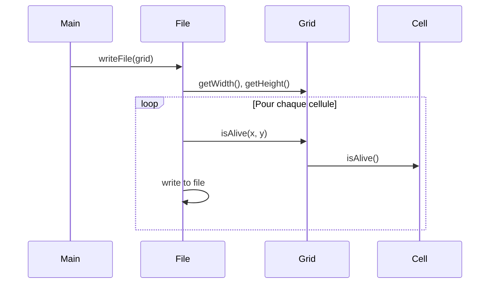

```mermaid
sequenceDiagram
participant Main
participant File
participant Grid
participant Cell

    Main->>File: writeFile(grid)
    File->>Grid: getWidth(), getHeight()
    loop Pour chaque cellule
        File->>Grid: isAlive(x, y)
        Grid->>Cell: isAlive()
        File->>File: write to file
    end
```