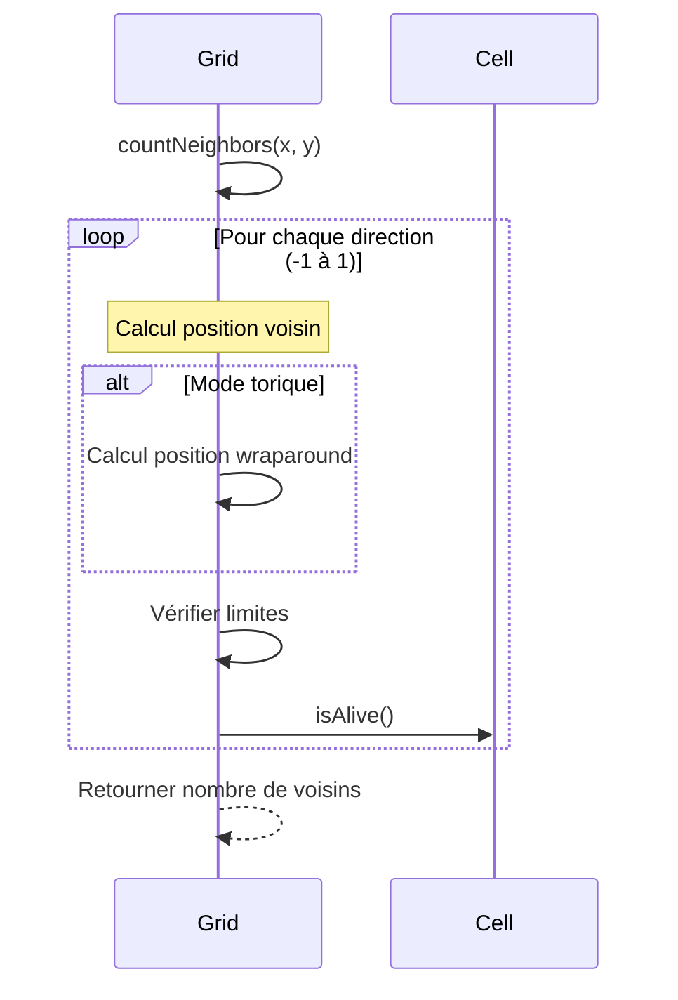

```mermaid
sequenceDiagram
    participant Grid
    participant Cell
    
    Grid->>Grid: countNeighbors(x, y)
    loop Pour chaque direction (-1 à 1)
        Note over Grid: Calcul position voisin
        alt Mode torique
            Grid->>Grid: Calcul position wraparound
        end
        Grid->>Grid: Vérifier limites
        Grid->>Cell: isAlive()
    end
    Grid-->>Grid: Retourner nombre de voisins
```