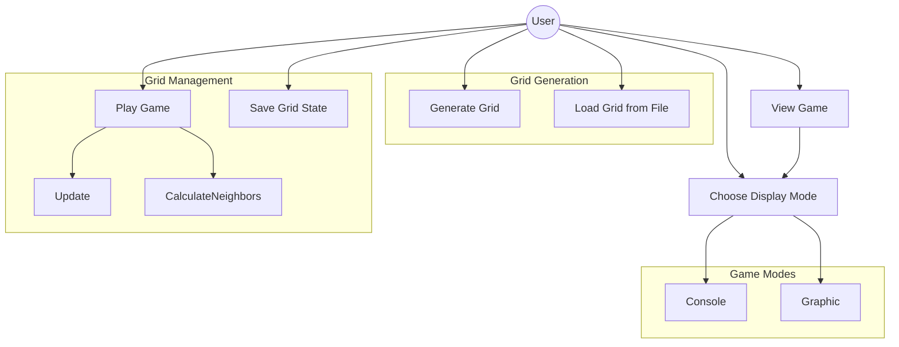

```mermaid 
flowchart TD
User((User))

    usecase1[Generate Grid]
    usecase2[Load Grid from File]
    usecase3[View Game]
    usecase4[Play Game]
    usecase5[Save Grid State]
    usecase6[Choose Display Mode]

    User --> usecase1
    User --> usecase2
    User --> usecase3
    User --> usecase4
    User --> usecase5
    User --> usecase6

    usecase3 --> usecase6
    usecase6 --> Console
    usecase6 --> Graphic

    subgraph Game Modes
        Console
        Graphic
    end

    subgraph Grid Generation
        usecase1
        usecase2
    end

    subgraph Grid Management
        usecase4 --> Update
        usecase4 --> CalculateNeighbors
        usecase5
    end
```